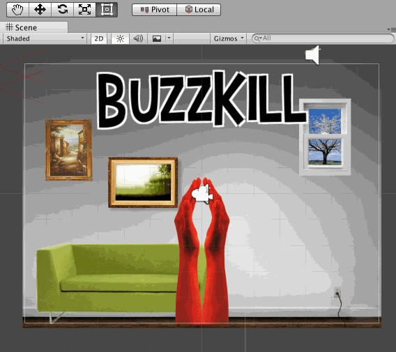
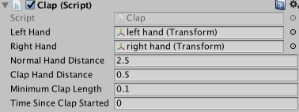
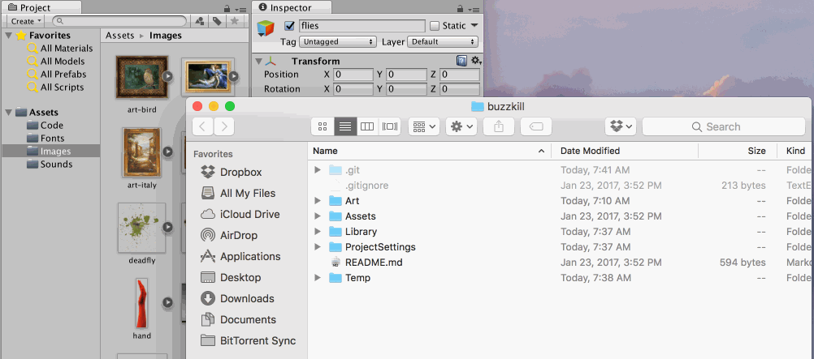
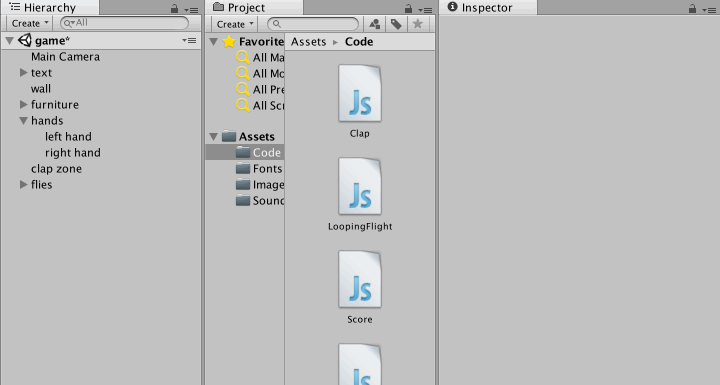
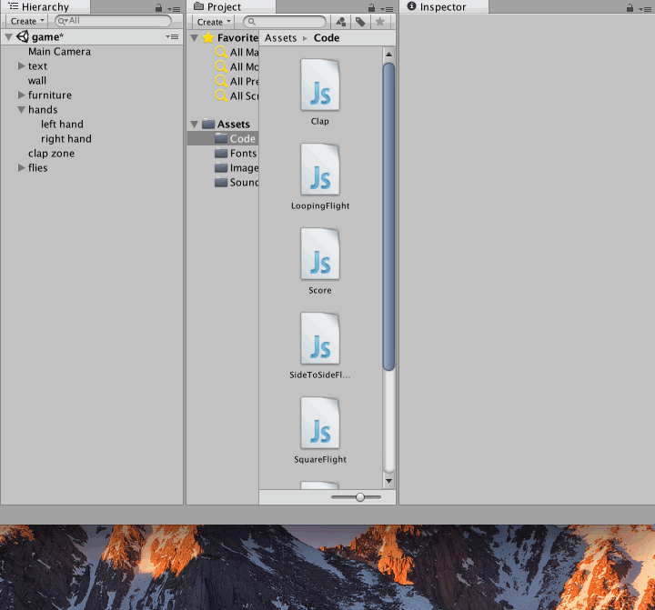
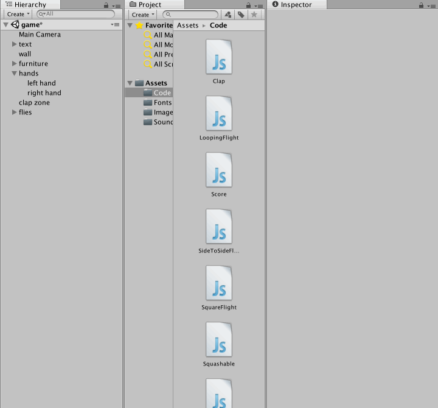
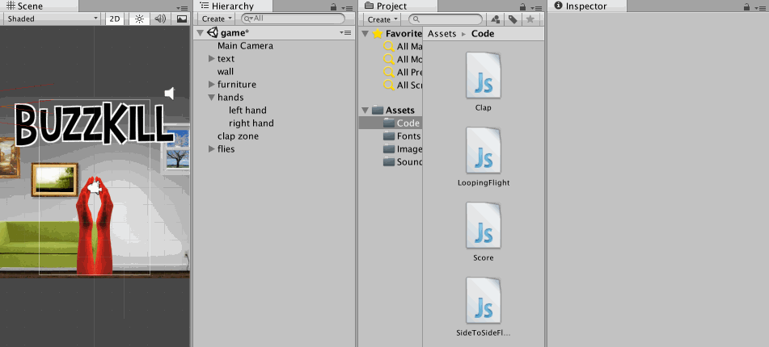

# Buzzkill

## Learning Goals
- Introduction to Playable Fashion by creating a glove controller, using the FLORA, coding for Unity, and modding games
- Identifying and familiarizing how custom wearable game controllers can and do exist
- Comfort with various tools and materials

## Prerequisites
- **The FLORA** Adafruit has a great tutorial to show how to set up the FLORA and to download code onto it using the Arduino IDE: [https://learn.adafruit.com/getting-started-with-flora/overview](https://learn.adafruit.com/getting-started-with-flora/overview). Also some basic knowledge of programming using the Arduino programming language will help — i.e., setting up variables, if statements, for loops, loading libraries and code structure).
- **Unity** While no code will be written in Unity, knowledge of the game engine is important. At the very least an understanding of the interface and concepts are required to be able to effectively answer questions and guide students through the exercise. Unity’s own tutorials are a good place to start: https://unity3d.com/learn/tutorials/topics/interface-essentials
  - At the minimum check out video 1 under “Using the Unity Interface” and video 1 under ”Essential Unity Concepts". The remaining videos in that topic are strongly recommended, but not required.

## Materials (25 students)
| Item                    | Quantity           | Link | Notes |
| ----------------------- | ------------------ | ---- | ----- |
| Copper Fabric           | 1 yard             | [🔗](http://www.lessemf.com/fabric4.html#1212)
| Gloves                  | 10 packs           | [🔗](http://www.homedepot.com/p/HANDS-ON-Cotton-Poly-All-Purpose-Brown-Jersey-3-Pack-CT7000-HOWG-L-3PK/202591309) | 1 pair per student + 5 extra
| Adhesive Bonding Paper  | 1 roll             | [🔗](http://a.co/8CfSR3c)
| Craft Foam              | 1 pack             | [🔗](http://a.co/3GCBj5K)
| FLORA                   | 35 boards          | [🔗](https://www.adafruit.com/product/659) | 1 per student + 10 extra
| USB cords for FLORA     | 25 cords           | [🔗](https://www.adafruit.com/product/592)
| Alligator Clips         | 5 packs = 60 clips | [🔗](https://www.adafruit.com/product/1008) | 2 per student + 10 extra

## Tools
Ideally, having a glue gun and iron per 5 students helps. Also, 1 scissors per person helps, but can be a scissor per 2 students. Otherwise, there will a bottlenecking problem at the hot glue gun and iron stations.

- Glue gun and glue sticks
- Scissors that can cut fabric
- Iron (NOTE: any crappy iron will d, whether travel or regular. Just keep in mind that inevitable the adhesive will get on the surface and make it unusable for regular clothes ironing. So it is best to designate the iron as a “craft Iron”.)
- Scrap cotton fabric (NOTE: 1ft x 1 ft piece should suffice. Must be 100% cotton so it doesn’t burn. Have one of these per iron you have.)

## Setting Up
- Brightly lit room
- Enough clear table space to work on
- Prep computers with software:
  - Arduino IDE using this set up [https://learn.adafruit.com/getting-started-with-flora/overview](https://learn.adafruit.com/getting-started-with-flora/overview)
  - Unity
    - Make sure every computer in the classroom is running *the same version* of Unity
    - To save time, have Unity already launched and open to the Buzzkill scene before class starts
- Ensure that students know how to copy & paste code using the computers
- Pass the worksheet pdf to students and print out at least the FIRST page of the worksheet, so that the student can cut out the templates. The sheet MUST be printed at 100% SCALE in order to retain the correct sizing of the template.
- Setting up a different table for just the hot tools (iron and glue gun) can help make the learning space safer, because not only does it spatially separate it from the other work, but it helps the student identify that these tools require more careful use.

## Lesson Plan

### Session One

- Demo of Buzzkill game.
- [Show slideshow](files/buzzkill-sample-slideshow.pdf)(What is Playable Fashion, What is a Circuit, What is the FLORA, Intro to Coding for FLORA)
- Making gloves with [glove-worksheet.pdf](files/glove-worksheet.pdf) - introduction to worksheets, materials, tools.
- Safety - hot glue guns, iron.
- Showing demos at the start of each phase (in small groups so everyone can see).
  - 1st demo: ironing with protective piece of muslin/cotton, so iron does not get sticky. Ironing all layers together, paper removal from adhesive, trimming edges of pad, adhesive paper removal.
  - 2nd demo: glue gunning pads to gloves. Using a method where you first glue the center part of the pad to the glove, then turning pad side down, lifting glove material to put glue along the edge of the pad, then pressing the glove material down. This is a cleaner, neater method of gluing.
- Clipping alligator clips to gloves and FLORA.
- Upload code to FLORA. [glove-code.ino](files/glove-code.ino)
- Referencing Computer sponge workshop when going through lines of code.
- Having them then mod the code to type out their name when hands are clapped.
- The FLORA can mimic a keyboard and the gloves can be mapped to the space bar. This can be demonstrated with the following one-button web browser games which use the space bar:
  - https://jackv24.itch.io/space-dash
  - [Cananbalt](http://adamatomic.com/canabalt/)
  - https://cozygamepals.itch.io/jump-doper
- Discussion:
  - How do we normally play video games?
  - What kind of interactions do traditional controllers provide?
  - What other interactions, besides clapping, can you think of? Can two players interact with each other to make a game using the controllers?
  - Is this the future?

### Session Two

- Have students open [Buzzkill](https://github.com/nasser/buzzkill) in Unity and play the game with their gloves
- Have everyone use the 2 by 3 layout.
- Walk through of the Unity interface.
- Explain the Scene Tab as the place they can visually edit their scenes
- Demonstrate movement through 2D space e.g. panning and zooming.

- Demonstrate manipulating objects, e.g. moving and rotating them.

- Make sure everyone is comfortable in the Scene tab before moving on.
- Explain the Game Tab as a preview of what players will see. It is controlled by the Main Camera object and is most active in Play Mode.
- Explain the Hierarchy Tab as a listing of every object in the scene
- Demonstrate the equivalence of selecting an object in the Hierarchy vs selecting an object in the Scene view.
- Explain the Inspector Tab as a listing of all the components on the selected object
- Explain the GameObject–Component relationship, highlighting that GameObjects are collections of Components, and Components specify the way a GameObject behaves. [Unity’s video](https://www.youtube.com/watch?v=9Nf2_ds5y8c) on the subject is a good resource for this.
- Demonstrate equivalence of moving objects in the scene tab and manipulating values in the object's transform component.
- Have students hack values in the scene and observe the effects on the game. Some suggested hacks are listed below and mentioned in the digital worksheet.

- Explain swapping out of sprites and importing assets from the internet, and have students do that.
  - Having students use Google images to search for new images to use in the game is ideal. If internet access is hard to come by, we’ve included an Art folder with art they can use instead.

- Explain swapping out audio and have students do that.
- Walk through the custom code briefly, mentioning lessons learned during the FLORA component and sponge computer.
- Explain the how to modify the values of our custom components, and have students do that.
- Suggested hacks

  - Make the flies go faster
    - Select all the “fly” objects under the “flies” object in the Hierarchy
    - Find the Looping Flight Script Component in the inspector
    - Change the Fly Speed property to 15

  - Make the fly differently
    - Select all the “fly” objects under the “flies” object in the Hierarchy
    - Find the Looping Flight Script Component in the inspector
    - Click the gear icon in the top right corner of the Component and select Remove Component from the popup
    - Scroll to the bottom of the inspector and click Add Component
    - Type SideToSideFlight and hit enter
    - Now select each fly object and give them different values for the properties under the Side To Side Flight

  - Change the way the flies look
    - Select all the “fly” objects under the “flies” object in the Hierarchy
    - Find the Sprite Renderer Component in the inspector
    - Click the small circle next to the box for the Sprite property
    - Choose a different image for the flies

  - Change the way the hands look
    - Select the “left hand” and “right hand” objects under the “hands” object in the Hierarchy
    - Find the Sprite Renderer Component in the inspector
    - Click the small circle next to the box for the Sprite property
    - Choose a different image for the hands

  - Make a bigger clap zone
    - Select the “clap zone” object in the Hierarchy
    - Find the Box Collider 2D Component in the Inspector
    - Increase the X property under size, watching the change in the Scene view
    - Increase the Y property under size, watching the change in the Scene view

- Make more flies
  - Select all the “fly” objects under the “flies” object in the Hierarchy
  - Right click on them and select Duplicate
- Suggest alternate stories the game could tell with new assets
  - Bubble popper — where hands pop bubbles instead of squish flies
  - Spatulas cracking eggs — with hands replaces with spatulas and flies replaced with eggs
  - Paper crumpler – where hands turn sheets of paper into crumpled up balls of paper
- Use the remaining time to keep hacking the game or designing the gloves.
- Discussion:
  - How does changing art assets affect the game?
  - How does changing values on components affect the game?
  - What could you change? What couldn’t you change?
- Things to look out for:
  - Students becoming “bored” with their gloves and changing component values and asking how they could make their own controllers write their own components. This segues into our fashion and technology and coding in depth modules.

### Pipeline to Add Images to Game
Since there are so many image editing tools out there, and so many ways to integrate them into the classroom, instead of requiring a particular software, we want to just mention the minimal functionalities that are required to run this workshop. Therefore, whatever tool is used in class, the students should know the following, at the very least:

1. Know how to copy an image off of the browser and open in the image editing tool.
2. Make image background transparent.
3. Draw/fill and add text.
4. Crop image.
5. Save the image in .png format with transparent background.

If an introduction to an image editing tool is needed, [miniPaint](http://viliusle.github.io/miniPaint/) is a free, open image editing software that is easy to use and can be used online without having to download software.
Here is a [guide for miniPaint](./miniPaint-Guide.md) to be used in this module.
