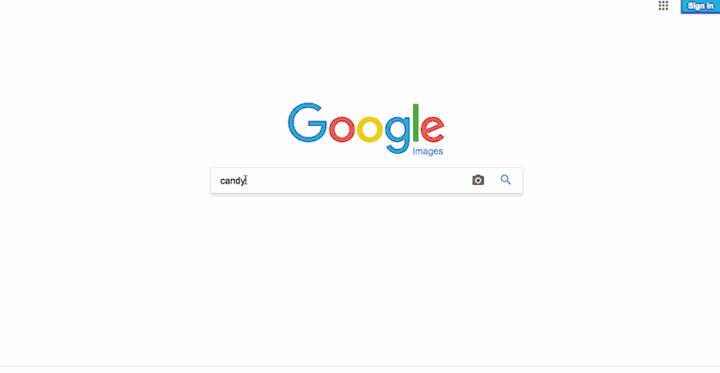
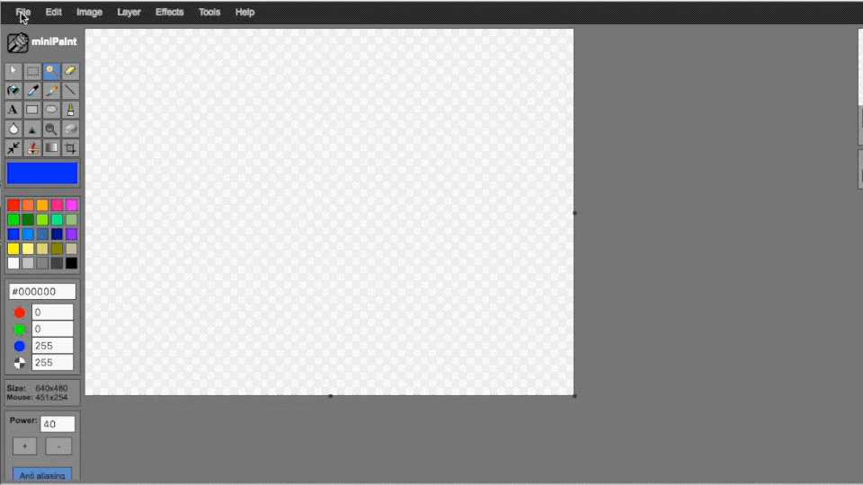
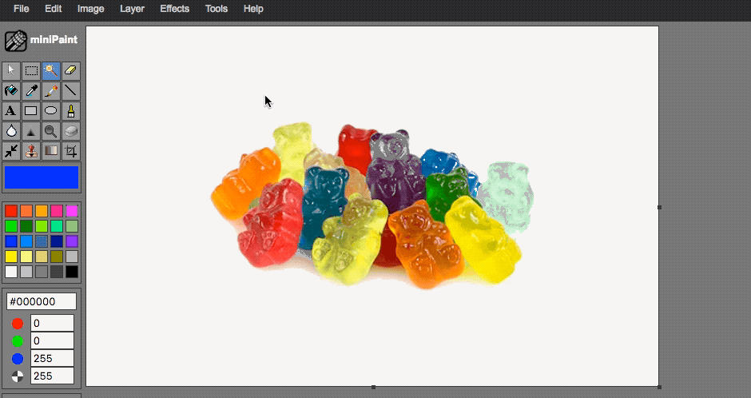
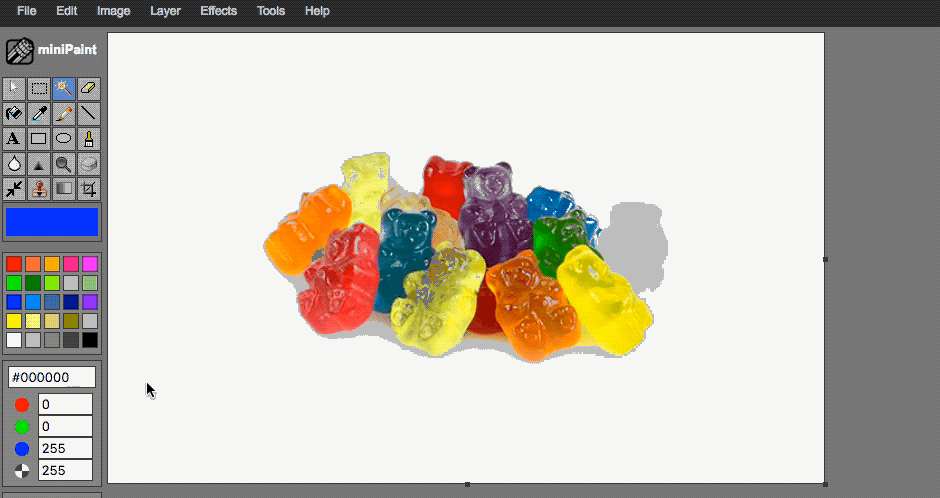
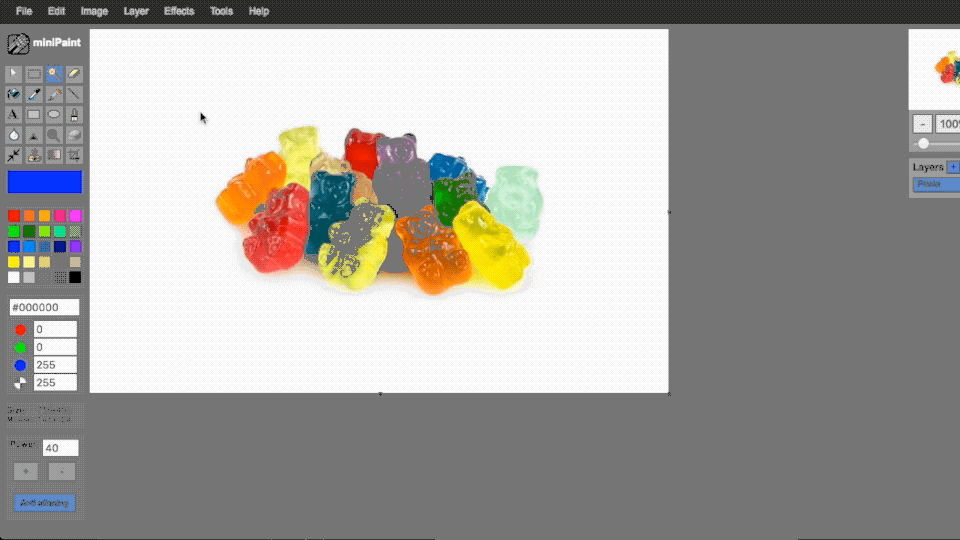
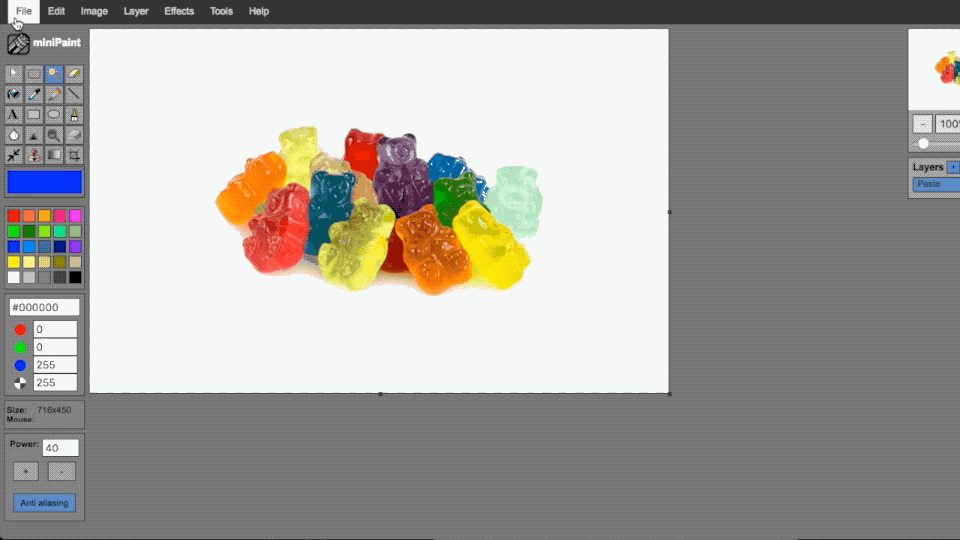

# miniPaint Guide Sheet for Buzzkill
Make images with transparent backgrounds for games with [miniPaint](http://viliusle.github.io/miniPaint/), a free online image editor.

## **Copying an Online Image into miniPaint**

1. Find an image online in your web browser
2. Right click and "copy image". 

*NOTE: If you're using a google image search, make sure you click the "view image" button first before copying image.* 

3. Return to MiniPaint, and paste with CTRL+V (Windows) or COMMAND+V (Mac)

## **Opening an Image File Saved on Your Computer in miniPaint**

1. On the Menu at the top of the miniPaint screen, choose File then Open. 
2. Select the image file and click the Open button. 

## **Resizing image you have imported into miniPaint**

1. On the right hand side of the miniPaint screen, there are layers. Each image you imported should have its own layer. Make sure you select the layer of the image you would like to resize. 
2. On the menu at the top of screen, go to Layer, then to resize. 
3. Set your resizing options in the resizing window and select OK.

*NOTE: If the image you imported is larger than the document image size, the document image size will change to match the size of the imported image. In this case, you may have to resize your document.*

## **Resizing the Document**

1. On the Menu at the top of the miniPaint screen, choose Image then Resize. 
2. Resize to desired size, and click OK. 

## **Making Background Transparent**

1. If you can see the default checkered background, then your image already has a transparent background. If it doesn’t then, make sure you’ve selected the layer with the image you’d like to make transparent. 
2. Choose the magic wand tool on the grid of tools under the miniPaint logo. 

3. Click on the background areas to delete. 
4. If it deletes too much or too little, the “power” of the wand can be changed by adjusting the values in the power window on the lower left of the screen. 

## **Saving as .png file with transparent background**

1. On the Menu at the top of the miniPaint screen, choose File then Save As. 
2. Name your file, make sure PNG is selected, and click OK. 

