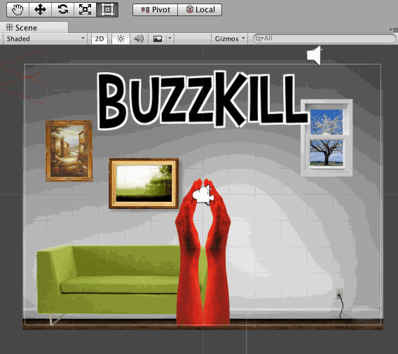
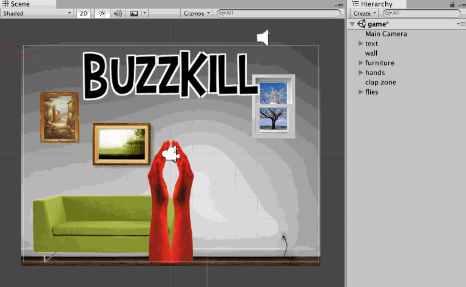
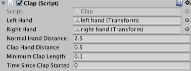
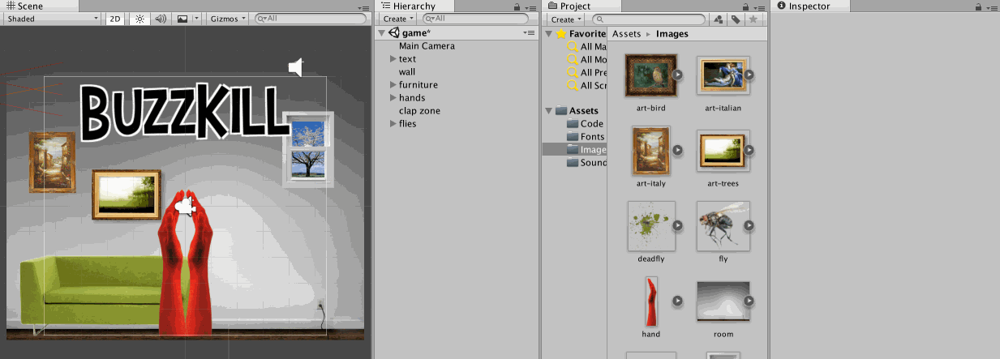
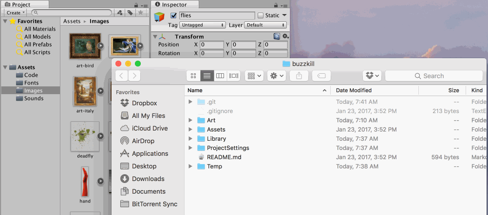
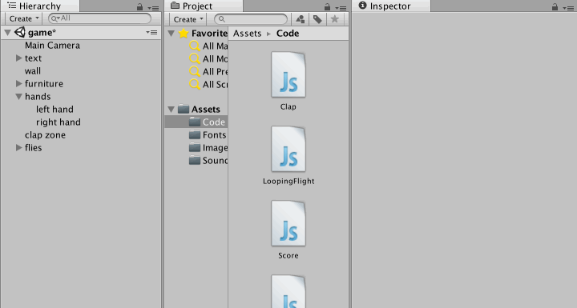
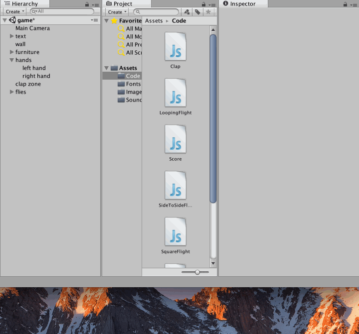
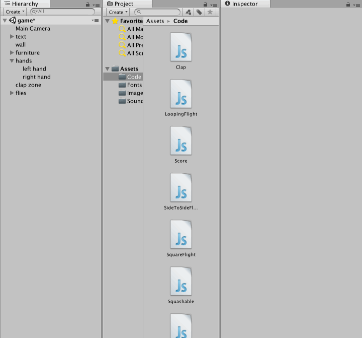
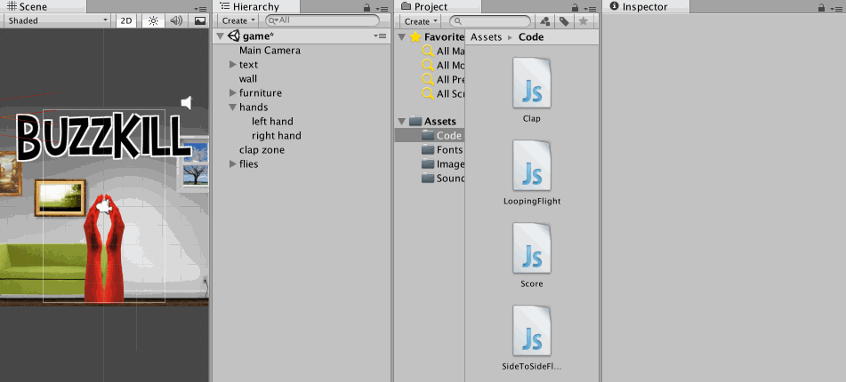
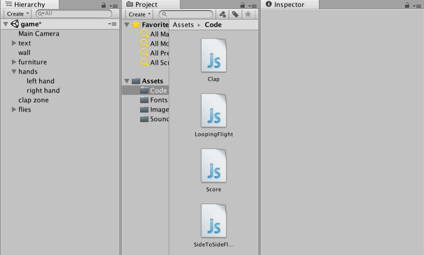

# Buzzkill Lesson Plan

# Summary

The Buzzkill module is an introduction to wearable game controller and preview into the Playable Fashion program, using the Adafruit FLORA and Unity 3D development tools. Most people approach the program not knowing what a wearable game controller is, since there have not been many successful examples in consumer electronics. Participants are asked to make a pair of clapping glove controllers, and through modding a the demo game Buzzkill, we also touch upon game design and programming.

Our goal is to have the student leave the module being excited about this unexplored world of wearable game controllers, a peek into the tools and skills that are needed to make the games, and an understanding of what the entire Playable Fashion program is like.

# Learning Goals
- Introduction to Playable Fashion by creating a glove controller, using the FLORA, coding for Unity, and modding games
- Identifying and familiarizing how custom wearable game controllers can and do exist
- Comfort with various tools and materials

# Context

## What are Wearable Game Controllers?

Most digital games we play are on game consoles like the Playstation or the XBox using a traditional game controller, or on the PC, using a keyboard and mouse. Nintendo Wii and Switch break the traditional controller mold a bit, but none of these controllers are wearable. There are examples like those used in [Laser Tag](https://en.wikipedia.org/wiki/Laser_tag), and consumer electronics, for example, the [Nintendo Power Glove from 1989](https://en.wikipedia.org/wiki/Power_Glove), or [the Essential Reality P5 Gaming Glove from 2002](https://www.youtube.com/watch?v=2P7H911-mkg). VR headsets are wearable, but they may not be considered controllers, as their main function is outputting images on a screen, rather than sensing direct interactions by the user. But in essence, wearable game controllers can be thought of a kind of controller that has yet to be thoroughly explored.

Most people may not know what wearable game controllers are, but when we think about the developments in and miniaturization of technology, we can start imaging sensors and switches being embedded into things that we wear. If we think about the avatar in a video game, with wearable game controllers, we can “dress up” as the avatar and even play the games with physical gestures that the avatar may perform. Increasing popularity in cosplay, LARPing and Theater-game experiences show potential for costumes to have embedded sensors. This is an exciting time, where we can start to see emerging applications for wearable game controllers.

## Why Wearable Game Controllers?

Games, technology and fashion are interests that a lot of youth have. But without knowing how the technology works, or how it’s made, it is easy for anyone to remain consumers. Learning the technology, skills and thinking behind making these experimental games can help them become producers of games, rather than just consumers.

Moreover, because wearable game controllers are largely unexplored, it is a wonderful space for students to create their own innovative prototypes and explore what they envision the future of games and technology to be. And if we begin to identify that the video games are indeed stuck in a traditional controllers, console and monitor model, we can start to imagine bringing in the video game into our physical world. We can begin to ask: What if we had unique controllers for every video game that was made? As technology becomes more embedded into our physical world, will game interfaces also follow suit? Is this the future of games?

## Hacking and Modding

Buzzkill introduces game design by way of the popular practices of *hacking* and *modding*. Hacking is the altering of an existing technological artifact to do something it was not originally intended to do, and modding is the modification of an existing game to play differently. We present students with an existing game and invite them to hack it and change the way it works without writing any code. This works to instill early excitement and gratification in the class without the complications of writing code. This also communicates the larger point that students need not take the world as its given to them, and that they are encouraged to dissect and hack the games and technology in their life to better understand it and to more fully own it.

## Custom Controller

Buzzkill uses a controller that the students themselves construct, but still communicates with a conventional computer. This is possible because the controller emulates a keyboard, so the computer cannot tell the difference. This kind of simple interfacing trick is important when getting systems to talk to each other. Buzzkill is also an example of how games using controllers that are can be wearable and quite different from conventional gamepads can unlock totally new play experiences. The controller itself can be modded to match the aesthetic and narrative of the game, allowing for an additional dimension of self expression.

## Prototyping and Mastery of Tools and Materials

When working on hands-on projects, it is important to experience the physical and tactile experience of fabricating a prototype. There are many details that can only be experienced first hand by the participant, and that no amount of textbooks or instructions can communicate. Understanding the nuances of a material or tool is the first step towards attaining mastery of the material or tool and ultimately being able to utilize them to be able to make any kind of prototype imagined. It is worth mentioning this at the end of the module in order to make this point more obvious, by pointing out certain characteristics of the tools and materials they’ve just used. For example, the rate at which the glue comes out of that specific glue gun, or how foam reacts to too much heat.

## FLORA

We will use [Adafruit’s FLORA](https://www.adafruit.com/product/659) which is an Arduino-based open source development tool specifically designed to be used for wearable technology projects. The “petals” on the perimeter of the FLORA allow alligator clips or conductive thread to be used to attach to various components. The FLORA is programmed using the Arduino IDE, with the Arduino Programming Language. A wonderful built-in feature of the FLORA is that it can act like a  [USB HID Keyboard](https://en.wikipedia.org/wiki/USB_human_interface_device_class). So it can be connected to any computer as any USB keyboard might be, and programmed to mimic any keyboard strokes or any mouse clicks.

## Unity

Unity is the industry standard game engine used by small independent developers and large corporate game studios alike. It’s first release was in 2005 and it became massively popular around 2008 due to its ability to build high performance games to the iPhone. Since then, it has been extended to build games to 27 different platforms. That said, Unity 3D has always had a free version meant to be accessible to students and new comers to the industry, which makes it an affordable teaching tool.

Unity is programmed primarily in C#, but it is unique among similar tools in that it is centered on a style of programming called *Entity Component Systems*. Traditional approaches to programming were found to be insufficiently expressive for video game development around the early 2000s, and a series of papers and talks around alternatives began to emerge, most notably [Scott Bilas’s 2002 Game Developer’s Conference Talk “A Data-Driven Game Object System“](https://www.gamedevs.org/uploads/data-driven-game-object-system.pdf). This approach models a game as a collection of *entities*, which are little more than collections of *components* which do all the work. The experience of building a game involves writing reusable components and mixing and matching them on entities to create the final experience. This model is amenable to modding, hacking, and remixing, because any component can be attached to any entity, allowing for infinite variation without writing new code. This module in particular leans heavily on this expressive power.

We like teaching with Unity because it is the tool that we use ourselves in our creative practice and for paid contract work. This gives us a depth of experience to draw from in the classroom, but also ensures that we are starting our students down a path of learning that could eventually lead to them developing their own creative practice or finding employment. We think of Unity as having a “high ceiling” of expressivity, in that students are unlikely to dream up a game that Unity is unable to support. This is different from other, simpler, made-for-the-classroom tools.

## Worksheets and Guides

The worksheets, whether physical printouts or digital files, are designed to guide the students to work autonomously, at their own pace, freeing the teacher to give individualized attention to students who need it. However, it helps to have teachers show a mini-demonstration of a craft/sewing step before students arrive at a step on the worksheet. Mini demonstrations are best conducted with a small group of students -- however many can gather around and visibly see the physical act of creating. This may require the instructor to break up the class into smaller groups when demonstrating. This method of having the teacher show a mini-demonstration at various times during a class is a popular teaching technique used in sewing classes and in other craft-based learning scenarios.

When handing out the worksheets, all materials and tools should be presented and their characteristics reviewed before the students start making their gloves. For example, when mentioning the copper fabric and alligator clips that they are electrically conductive, or when mentioning the adhesive paper emphasizing which is the rough glue side and which is the smooth paper side. This helps the student familiarize with the materials and tools before they dive in.

## Correct Use of Tools and Safety

Because of the use of the hot glue gun and iron, safety is an important concern and one that should be emphasized throughout its use. While it is important to point out the hazards of the tools and that they can cause burns, it is crucial to instill confidence in the student that when these tools are used correctly, they will not be hurt and the results will be as expected.

  - Iron
    - The plate is hot, so don’t touch the plate!
    - Whenever you are done using it, set it upright so that the hot plate is not touching anything. Otherwise it might burn something or cause a fire.
    - Keep the cord away from whatever you are ironing, so that it doesn’t get tangled up.
    - When using the iron with the adhesive bond paper, the iron should be a dry iron, in other words the steam should be turned off.  Refer to the instructions for the adhesive bond paper for more information.
    - Whenever ironing the adhesive, it’s important to only keep the iron on for 5 seconds. Otherwise the adhesive will melt too much and create a mess, and the foam will start to curl at the edges
    - Iron should be used with a scrap piece of cotton between the iron and what is being ironed. This protects the prototype from direct heat, but also keeps from the adhesive from getting stuck and ruining the plate. The cloth must be cotton, because synthetics or even blends may melt or burn on the iron.  *note: the iron should be designated as a “craft” iron, as the plate will inevitably get messed up. Don’t use your home iron for this!*
    - TURN OFF THE IRON WHEN EVERYONE IS DONE USING IT!

  - Hot Glue Gun
    - The tip is hot, so don’t touch the tip!
    - Whenever you are done using it, set it upright so that the hot tip is not touching anything. Otherwise it might burn something or cause a fire.
    - Keep the cord away from whatever you are gluing, so that it doesn’t get tangled up.
    - Glue gun glue especially on fabric can create a mess that is hard to fix. To avoid this, when gluing the pad onto the glove, it helps to just glue the center of the pad to the glove first. Then with the pad faced down on the table, peel back the fabric of the glove to expose the wrong side of the pad. Apply glue to the exposed wrong side of the pad, and then carefully lay the glove fabric over it. Wait a few seconds for it to solidify before picking it up from the table. Do this to the whole perimeter of the pad.
    - TURN OFF THE GLUE GUN WHEN EVERYONE IS DONE USING IT!

# Prerequisites
- **The FLORA** Adafruit has a great tutorial to show how to set up the FLORA and to download code onto it using the Arduino IDE: [https://learn.adafruit.com/getting-started-with-flora/overview](https://learn.adafruit.com/getting-started-with-flora/overview). Also some basic knowledge of programming using the Arduino programming language will help — i.e., setting up variables, if statements, for loops, loading libraries and code structure).
- **Unity** While no code will be written in Unity, knowledge of the game engine is important. At the very least an understanding of the interface and concepts are required to be able to effectively answer questions and guide students through the exercise. Unity’s own tutorials are a good place to start: https://unity3d.com/learn/tutorials/topics/interface-essentials
  - At the minimum check out video 1 under “Using the Unity Interface” and video 1 under ”Essential Unity Concepts". The remaining videos in that topic are strongly recommended, but not required.

# Materials (25 students)
| Item                    | Quantity           | Link | Notes |
| ----------------------- | ------------------ | ---- | ----- |
| Copper Fabric           | 1 yard             | [🔗](http://www.lessemf.com/fabric4.html#1212)
| Gloves                  | 10 packs           | [🔗](http://www.homedepot.com/p/HANDS-ON-Cotton-Poly-All-Purpose-Brown-Jersey-3-Pack-CT7000-HOWG-L-3PK/202591309) | 1 pair per student + 5 extra
| Adhesive Bonding Paper  | 1 roll             | [🔗](http://a.co/8CfSR3c)
| Craft Foam              | 1 pack             | [🔗](http://a.co/3GCBj5K)
| FLORA                   | 35 boards          | [🔗](https://www.adafruit.com/product/659) | 1 per student + 10 extra
| USB cords for FLORA     | 25 cords           | [🔗](https://www.adafruit.com/product/592)
| Alligator Clips         | 5 packs = 60 clips | [🔗](https://www.adafruit.com/product/1008) | 2 per student + 10 extra

- Copper Fabric: [Less EMF](http://www.lessemf.com/fabric4.html#1212) (1 yard)
- Gloves:
  - [Home Depot](http://www.homedepot.com/p/HANDS-ON-Cotton-Poly-All-Purpose-Brown-Jersey-3-Pack-CT7000-HOWG-L-3PK/202591309) (10 x pack = 25 pairs + 5 extra) 
  - **OR** [Amazon](https://www.amazon.com/dp/B005ETA2EG/ref=cm_sw_su_dp) (3 x pack = 25 pairs + 24 extra) 
- Adhesive Bonding Paper: [Amazon](http://a.co/8CfSR3c) (1 x roll)
- Craft Foam: [Amazon](http://a.co/3GCBj5K) (1 pack)
- FLORA: [Adafruit](https://www.adafruit.com/product/659) (35 x)
- USB cords for FLORA: [Adafruit](https://www.adafruit.com/product/592) (25 x)
- Alligator Clips: [Adafruit](https://www.adafruit.com/product/1008) ( 5 x pack = 60 clips, 2 per student + 10 extra)

# Tools
Ideally, having a glue gun and iron per 5 students helps. Also, 1 scissors per person helps, but can be a scissor per 2 students. Otherwise, there will a bottlenecking problem at the hot glue gun and iron stations.

- Glue gun and glue sticks
- Scissors that can cut fabric
- Iron (NOTE: any crappy iron will d, whether travel or regular. Just keep in mind that inevitable the adhesive will get on the surface and make it unusable for regular clothes ironing. So it is best to designate the iron as a “craft Iron”.)
- Scrap cotton fabric (NOTE: 1ft x 1 ft piece should suffice. Must be 100% cotton so it doesn’t burn. Have one of these per iron you have.)

# Setting Up
- Brightly lit room
- Enough clear table space to work on
- Prep computers with software:
  - Arduino IDE using this set up [https://learn.adafruit.com/getting-started-with-flora/overview](https://learn.adafruit.com/getting-started-with-flora/overview)
  - Unity
    - Make sure every computer in the classroom is running *the same version* of Unity
    - To save time, have Unity already launched and open to the Buzzkill scene before class starts
- Ensure that students know how to copy & paste code using the computers
- Pass the worksheet pdf to students and print out at least the FIRST page of the worksheet, so that the student can cut out the templates. The sheet MUST be printed at 100% SCALE in order to retain the correct sizing of the template.
- Setting up a different table for just the hot tools (iron and glue gun) can help make the learning space safer, because not only does it spatially separate it from the other work, but it helps the student identify that these tools require more careful use.

# Lesson Plan

## Session One

- Demo of Buzzkill game.
- [Show slideshow](files/buzzkill-sample-slideshow.pdf)(What is Playable Fashion, What is a Circuit, What is the FLORA, Intro to Coding for FLORA)
- Making gloves with [glove-worksheet.pdf](files/glove-worksheet.pdf) - introduction to worksheets, materials, tools.
- Safety - hot glue guns, iron.
- Showing demos at the start of each phase (in small groups so everyone can see).
  - 1st demo: ironing with protective piece of muslin/cotton, so iron does not get sticky. Ironing all layers together, paper removal from adhesive, trimming edges of pad, adhesive paper removal.
  - 2nd demo: glue gunning pads to gloves. Using a method where you first glue the center part of the pad to the glove, then turning pad side down, lifting glove material to put glue along the edge of the pad, then pressing the glove material down. This is a cleaner, neater method of gluing.
- Clipping alligator clips to gloves and FLORA.
- Upload code to FLORA. [glove-code.ino](files/glove-code.ino)
- Referencing Computer sponge workshop when going through lines of code.
- Having them then mod the code to type out their name when hands are clapped.
- The FLORA can mimic a keyboard and the gloves can be mapped to the space bar. This can be demonstrated with the following one-button web browser games which use the space bar:
  - https://jackv24.itch.io/space-dash
  - [Cananbalt](http://adamatomic.com/canabalt/)
  - https://cozygamepals.itch.io/jump-doper
- Discussion:
  - How do we normally play video games?
  - What kind of interactions do traditional controllers provide?
  - What other interactions, besides clapping, can you think of? Can two players interact with each other to make a game using the controllers?
  - Is this the future?

## Session Two

- Have students open [Buzzkill](https://github.com/nasser/buzzkill) in Unity and play the game with their gloves
- Have everyone use the 2 by 3 layout.
- Walk through of the Unity interface.
- Explain the Scene Tab as the place they can visually edit their scenes
- Demonstrate movement through 2D space e.g. panning and zooming.

- Demonstrate manipulating objects, e.g. moving and rotating them.

- Make sure everyone is comfortable in the Scene tab before moving on.
- Explain the Game Tab as a preview of what players will see. It is controlled by the Main Camera object and is most active in Play Mode.
- Explain the Hierarchy Tab as a listing of every object in the scene
- Demonstrate the equivalence of selecting an object in the Hierarchy vs selecting an object in the Scene view.
- Explain the Inspector Tab as a listing of all the components on the selected object
- Explain the GameObject–Component relationship, highlighting that GameObjects are collections of Components, and Components specify the way a GameObject behaves. [Unity’s video](https://www.youtube.com/watch?v=9Nf2_ds5y8c) on the subject is a good resource for this.
- Demonstrate equivalence of moving objects in the scene tab and manipulating values in the object's transform component.
- Have students hack values in the scene and observe the effects on the game. Some suggested hacks are listed below and mentioned in the digital worksheet.

- Explain swapping out of sprites and importing assets from the internet, and have students do that.
  - Having students use Google images to search for new images to use in the game is ideal. If internet access is hard to come by, we’ve included an Art folder with art they can use instead.

- Explain swapping out audio and have students do that.
- Walk through the custom code briefly, mentioning lessons learned during the FLORA component and sponge computer.
- Explain the how to modify the values of our custom components, and have students do that.
- Suggested hacks

  - Make the flies go faster
    - Select all the “fly” objects under the “flies” object in the Hierarchy
    - Find the Looping Flight Script Component in the inspector
    - Change the Fly Speed property to 15

  - Make the fly differently
    - Select all the “fly” objects under the “flies” object in the Hierarchy
    - Find the Looping Flight Script Component in the inspector
    - Click the gear icon in the top right corner of the Component and select Remove Component from the popup
    - Scroll to the bottom of the inspector and click Add Component
    - Type SideToSideFlight and hit enter
    - Now select each fly object and give them different values for the properties under the Side To Side Flight

  - Change the way the flies look
    - Select all the “fly” objects under the “flies” object in the Hierarchy
    - Find the Sprite Renderer Component in the inspector
    - Click the small circle next to the box for the Sprite property
    - Choose a different image for the flies

  - Change the way the hands look
    - Select the “left hand” and “right hand” objects under the “hands” object in the Hierarchy
    - Find the Sprite Renderer Component in the inspector
    - Click the small circle next to the box for the Sprite property
    - Choose a different image for the hands

  - Make a bigger clap zone
    - Select the “clap zone” object in the Hierarchy
    - Find the Box Collider 2D Component in the Inspector
    - Increase the X property under size, watching the change in the Scene view
    - Increase the Y property under size, watching the change in the Scene view

- Make more flies
  - Select all the “fly” objects under the “flies” object in the Hierarchy
  - Right click on them and select Duplicate
- Suggest alternate stories the game could tell with new assets
  - Bubble popper — where hands pop bubbles instead of squish flies
  - Spatulas cracking eggs — with hands replaces with spatulas and flies replaced with eggs
  - Paper crumpler – where hands turn sheets of paper into crumpled up balls of paper
- Use the remaining time to keep hacking the game or designing the gloves.
- Discussion:
  - How does changing art assets affect the game?
  - How does changing values on components affect the game?
  - What could you change? What couldn’t you change?
- Things to look out for:
  - Students becoming “bored” with their gloves and changing component values and asking how they could make their own controllers write their own components. This segues into our fashion and technology and coding in depth modules.

## Pipeline to Add Images to Game
Since there are so many image editing tools out there, and so many ways to integrate them into the classroom, instead of requiring a particular software, we want to just mention the minimal functionalities that are required to run this workshop. Therefore, whatever tool is used in class, the students should know the following, at the very least:

1. Know how to copy an image off of the browser and open in the image editing tool.
2. Make image background transparent.
3. Draw/fill and add text.
4. Crop image.
5. Save the image in .png format with transparent background.

If an introduction to an image editing tool is needed, [miniPaint](http://viliusle.github.io/miniPaint/) is a free, open image editing software that is easy to use and can be used online without having to download software.
Here is a [guide for miniPaint](./miniPaint-Guide.md) to be used in this module.

