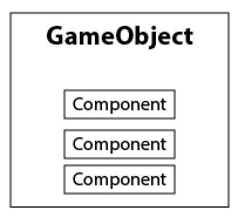
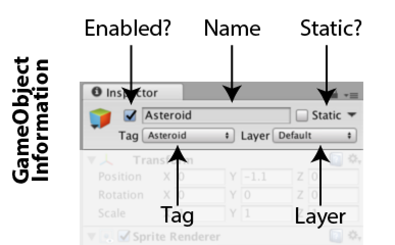
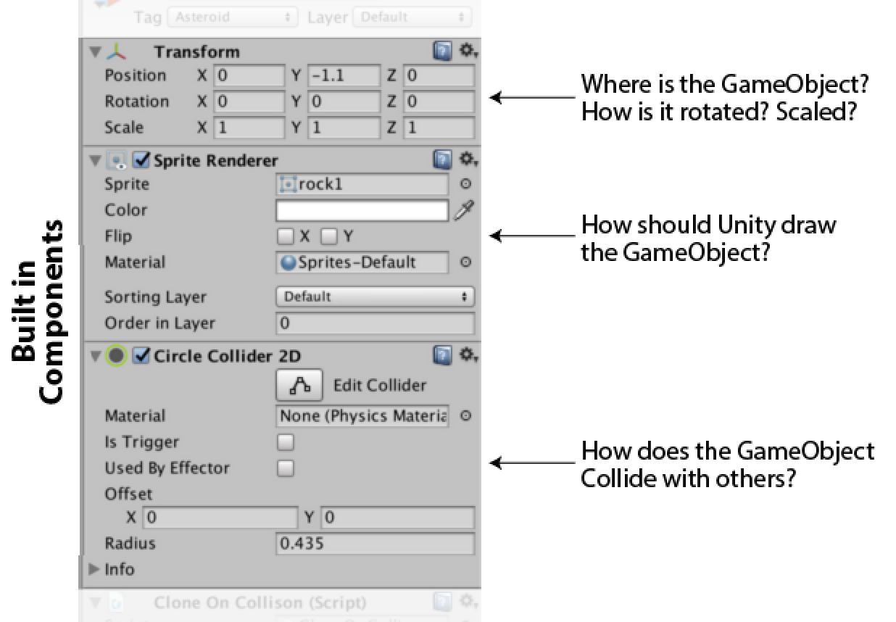
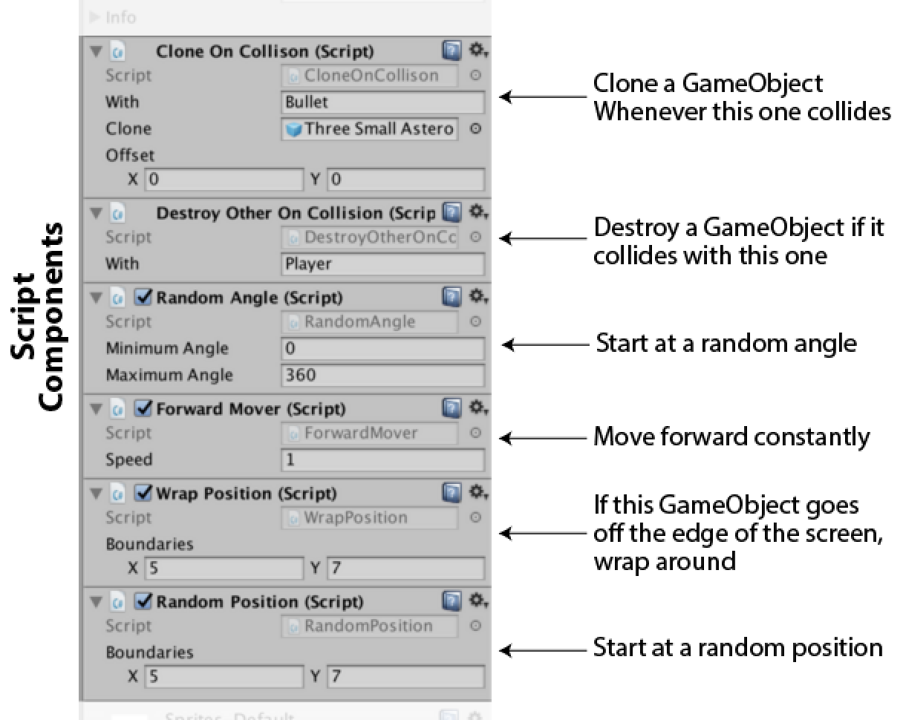

# Coding in Depth

The lesson is broken up into two parts: hacking and coding. The first session involves hacking an existing game in Unity to make it do new things. This serves as a concrete example of game development in general, and Unity in particular. The remaining sessions involve adding an additional element that requires new code to be written. By the end, students should have all made the same game.

## Prerequisites

None. Any experience writing code is a plus.

## Learning Goals
- Basic General Programming
- Basic Game Development
- Understanding of Unity
- Connect Techniques to Existing Games
- Rapid Iteration
- Game Logic

## Materials (per student)
- Computer
- Unity3D
- MonoDevelop
- [Unity Cheat Sheet](http://nas.sr/teaching/2015/game-design-studio/unity-cheat-sheet/)

## Session 1

### Summary
Students will be introduced to Unity by tweaking an existing game to turn it into something new

### Goals

- Understand Unity’s core concepts
    - Particularly GameObjects, Component, and Prefabs
- Get comfortable tweaking parameters
- Navigate in 3D Space
- Begin to see the need for writing code

### Plan

- two approaches
    - for teachers who know unity
    - for teachers who don’t

- All the computers should have been normalized as described earlier.
- Make sure computers are open to Unity with the project already loaded
- Describe Unity concepts
    - Unity’s core idea is: everything in your game is a *GameObject*, and you tell GameObjects how to act and how to look by attaching *Components* to them.
        - Illustrations along the lines of the following might help: 

        - GameObjects are only *containers* for Components. They do almost nothing on their own aside from hold on to a name, layer, tag and a few other bits of data.
        - All GameObjects are *the same* in the way that all supermarket bags are the same. They’re different only in what they *contain*, sometimes groceries, sometimes garbage, same bags.
        - Another way to explain it is that there are no “special objects” in Unity, only GameObjects with Components on them
            - For example, if Mario was made in Unity, there would be no “mario” object, just a normal GameObject named Mario with a Component that says what he looks like, a Component that says how he should move, a Component that says how he can get hurt, and so on.
            - “What if this game was in Unity?” is a good way to frame examples around this concept. Ask the students about their favorite games and start to think of potential GameObjects and Components there.
    - Everything flows from this idea, and understanding it is crucial
        - Try and stress this relationship whenever you can
        - Reference the history if you think that is helpful
    - Describe Unity’s UI
        - The Game Tab is what the player will see
        - The Project Tab is a list of all the files in the project
            - This includes images, sounds, and code
        - Stress that the Scene Tab and Hierarchy Tab *show all the GameObjects in the game* in different ways
            - The Scene Tab is a visual, 3D representation
                - Useful for a preview of how things will look
                - Or to move things around
            - The Hierarchy is a searchable list
                - Useful if you can’t visually find a GameObject
        - Demonstrate that GameObjects can be selected by clicking on them in the Scene or Hierarchy Tabs
            - Stress that clicking on an object in the Scene Tab selects in Hierarchy Tab and vice versa — they are the *same* object
        - Stress that the Inspector Tab displays information in the currently selected GameObjects
            - Specifically, it lists *all the components attached to them*
            - This is a good place to stress the GameObject Component relationship, the visual layout of the inspector places GameObject information at the top, and the rest is a list of Components (see below)
            - This is also a good place to point out that there are two different kinds of components: the ones built into unity, and the scripts that we write using code.
                - Unity’s components are general, and designed around things that most games need
                - Scripts are more specific and make up the unique aspects of our game

- TODO Prefabs
- Play the game
    - Have students play the game for some time
    - Afterwards, ask them what they thought
        - Was it fun? How? How not?
        - What would they change?
- Hack the game
    - Tweak values, add and remove components so that the game plays differently without writing code
    - The components that make up the game are designed for this
        - The names are descriptive and every field is commented with the role it plays
        - Familiarize yourself with the components before class so you can effectively hack the game
    - Guide students through hacking the game
        - Present them with a prompt (below) and go through it together as a class
        - State the goal of the hack and tweak the game to achieve it
        - Make sure to demonstrate: 
            - Changing values on a component
            - Adding a component
            - Removing a component
        - Do this on the projector and go around the class to make sure everyone was able to achieve the same result
    - Let them hack on their own
        - Present them with a prompt and give them a fixed amount of time to tweak the game to realize it
        - ?? Go around the class to answer individual questions
        - When time is up, have a short discussion about what they made and what that experience was like
        - Repeat for the remainder of class
    - An important point for them to reach is boredom with the pre-written components
        - This segues into coding well
    - Possible prompts:
        - How can we make it really hard?
        - How can we make it really easy?
        - How can we make it “better” ?
        - Their answers to the earlier question of what they would change

## Session 2
- Scripting
- Syntax
- Make connection with plain language ideas
- city.building.floor.room.drawer.sock
- Mailing Addresses
- Visualize before scripting
- Keyboard Input
- Example: DDR, Racing Games
- Update, Loop, Time
- Goal:
    - Understand Syntax
    - Flight Script

## Session 3 
- Scripting
- Colliders, Hitboxes
- [Street Fighter Example](images/streetfighter.jpeg)
- Deleting Objects
- Expose as many variables as possible
- Goals:
    - Stationary Enemy
    - Projectiles fired on key press
    - Enemies disappear on collision with projectile

## Session 4
- Enemy Motion
- Enemy Projectiles
- Learning After Class
- Goals:
    - Enemies Move
    - Enemies Fire Back
    - How to keep learning

