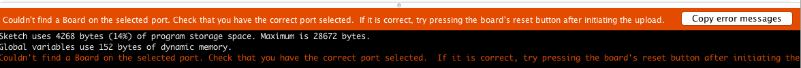

# Fashion in Depth

## Worksheets
* [Basic Sewing and Stitches Reference site](https://kahodesu.github.io/PF/)
* [PF Fashion In Depth Soft Button.pdf](files/soft-button.pdf) 
* [PF Fashion In Depth Glove.pdf](files/glove.pdf)

## Code for FLORA
It is intended for the student to mod the initial button code for the glove interface, and then frankenstein the Neopixel library example to arrive at the final code. The code below is for instructor’s reference or if there is limited time. 

* [PF Fashion Button Code](files/PF_Fashion_Button.ino) 
* [PF Fashion Button and Glove Code](files/PF_Fashion_Btn_and_Glove.ino)
* [PF All Together Code](files/PF_All_Together.ino)

- PF Fashion Button: This code is first used when the inner soft felt button is made. The onboard FLORA LED (not the onboard Neopixel) should light up when the button is pressed. 
- PF Fashion Button and Glove: This is the code when Button and Glove interfaces are combined.  The onboard FLORA LED (not the onboard Neopixel) should light up when the button or the glove is used. 
- PF All Together: This is the final code that combines both button and glove inputs, and lights up the Neopixels. Neopixels should turn red when button is pressed, and blue when glove is used. 

Depending on the version of your IDE, you may or may not have to import the keyboard library into the code. On the Arduino IDE >> Sketch >> Include Library >> Keyboard. That should add the keyboard library to the top line of the code.* **PLEASE CHECK THIS!**

**Keyboard** and **Debounce** functions have been commented out, but can be easily activated if un-commented. **Keyboard** code allows the FLORA to be used as a HID keyboard. The spacebar is a nice demo, since you can immediately play spacebar web games like [Canabalt](http://adamatomic.com/canabalt/) and check that the soft button works. **Debounce** is a method of double checking that a circuit was made, which is useful for hand made interfaces. A **delay()** can also be added if the switches are too sensitive. 

If you get this error, press the reset button on the FLORA immediately after you upload the code and wait for upload to complete. 

## Prerequisites
- The teacher should know basic sewing techniques before teaching this module. There are 3 stitches that are used for the exercise: straight stitch, basting, slip stitch. Demonstrating how to thread a needle, how to double thread a needle, how to knot the end of a stitch, how to cut off excess with scissors is important. 
- Cheatsheet and GIFs for basic sewing stitches: http://kahodesu.github.io/PF/
- Adafruit’s sewing with conductive thread: https://learn.adafruit.com/conductive-thread/overview
- Also teacher should know how to use the FLORA. Adafruit has a great tutorial to show how to set up the FLORA and to download code onto it. https://learn.adafruit.com/getting-started-with-flora/overview Also knowledge about downloading libraries and Neopixels help. 
- The teacher should know basic programming concepts (variables, for loops, if statements, etc)
- Abstract Electronic Toys is a good introduction to this module. Having taken Abstract Electronic Toys, the participants will come knowing more about conductive materials and electronic circuits. They would have been exposed to the concept behind tradition and style for code but with hardware (black and red wires). 
- This module is designed to be taught before World’s Slowest Computer and Coding in Depth. The difficulty of this approach lies somewhere between downloading code to use without modification (introductory level) and writing code from scratch (more advanced level, see Coding in Depth).

## Setting up before class
- Class space must be brightly lit and with enough table space to work on. 
- Computers should have Arduino preinstalled following: https://learn.adafruit.com/getting-started-with-flora/overview
- Alligator clips must be checked to see none are defective. This can save a lot of stress and troubleshooting! This can be done with the continuity test on a multimeter: http://en-us.fluke.com/training/training-library/test-tools/digital-multimeters/how-to-test-for-continuity-with-a-digital-multimeter.html
- Check visibility of code/text on class screen/monitor. The scale can usually be set through the display preferences on the computer or through the Editor font size settings on the Arduino IDE preferences. 
- Preparing Neopixels strips, if you are using them, by cutting them into groups of 3, then punching 3 holes at the end (at ground, 3.3v and data) with an awl to allow for the conductive thread to be sewn into them. 
- When printing the embroidery hoop fabric, you must use an ink jet printer. Precut the fabric into 8.5” x 8.5” squares and use the custom paper feeder to feed into the printer. Choose custom paper size at 8” x 8”. If the printing paper settings are set to “cardstock”, it helps the fabric pass through easier. Some printers may have a fabric setting. **THE SCALING MUST BE SET TO 100%** or the printed image will be too small to fit onto the hoop. Print quality should be set on the highest, otherwise it will look faded. Here are the PDF’s for printing - one is for the single neopixels and the other for the neopixel strip: 
    - [PF Fashion In Depth Hoop using Single Neopixels](files/hoop-single.pdf)
    - [PF Fashion In Depth Hoop using Neopixel Strip](files/hoop-strip.pdf)
- Print out extra copies of the first page of the glove worksheet so that the templates can be cut out of them. When printing, **THE SCALING MUST BE SET TO 100%** or the printed image will be the wrong size. 
- Playing music in the background while crafting can be relaxing and fun 🎵. 

## Learning Goals
The participants are lead through a series of demonstrations and exercises, with the goal for everyone to arrive at the same point by the end of the module, having learned the same basic skills, techniques and concepts, so that they are prepared to create their own prototypes collaboratively later on. 

- Basic Sewing
- Adafruit’s FLORA Microcontroller 
- Electronic Circuits (making and breaking a circuit, switches)
- Soft Circuits
- Neopixels
- Input & Output (The switches are input while the neopixels are output)
- Concepts in wearable interfaces and wearable technology 
- The Arduino Programming Language and IDE
- How to use a variety of tools: needle, scissors, embroidery hoop, iron, hot glue gun, microcontrollers with laptop
- How to use a variety of materials: adhesive paper, felt, foam, fabric, conductive fabric and thread, batting

## Materials (15 students)
If the budget or circumstance allows for this, it is recommended that the [FLORA budget pack](https://www.adafruit.com/products/1405) is used, which includes many of the materials below, in addition to some other components that might be useful in the long run. The materials in the budget pack are marked with a ★. 

| Item                     | Quantity           | Link | Notes |
| ------------------------ | ------------------ | ---- | ----- | 
| Gloves                   | 15 pairs           | [🔗](http://www.homedepot.com/p/HANDS-ON-Cotton-Poly-All-Purpose-Brown-Jersey-3-Pack-CT7000-HOWG-L-3PK/202591309)
| ★ Flora                  | 15 boards          | [🔗](https://www.adafruit.com/product/659)
| ★ Micro-B USB cord       |                    | 
| ★ Alligator Clip         | 12                 | [🔗](https://www.adafruit.com/products/1008)
| ★ Conductive Thread      | 4 / student        | [🔗](https://www.adafruit.com/products/641)
| Conductive Fabric        | 2 yards            | [🔗](http://www.lessemf.com/fabric4.html#1212)
| Conductive Fabric Tape   | 3 / student        | [🔗](http://www.lessemf.com/fabric.html#225)
| Iron On Adhesive         | 2 / student        | [🔗](https://amzn.com/B000XAMYXI)
| Ink Jet printed Canvas   | 2 packs            | [🔗](https://www.amazon.com/dp/B000F3FT3K/ref=cm_sw_su_dp)
| 6” Embroidery Hoop       | 1 / student        | [🔗](http://www.michaels.com/loops-and-threads-wooden-embroidery-hoop/M10124152.html?)
| Craft Foam               | 1 pack             | [🔗](https://www.amazon.com/dp/B00284I2FG/ref=cm_sw_su_dp)
| Fabric/Felt for applying | 2 packs            | [🔗](https://www.amazon.com/dp/B019RIWEEK/ref=cm_sw_su_dp)
| Glue gun & glue sticks   | 1 gun / 5 students | [🔗](https://www.amazon.com/dp/B01178RVI2)
| ★ Sewing Needles         |                    | [🔗](https://www.adafruit.com/products/615)| eye of the needle must be large enough to allow for conductive thread
| Scissors                 | 1 / student        | [🔗](http://a.co/asMCOWj) | a good pair of scissors that can cut fabric easily
| Batting/stuffing         | 1 pack             | [🔗](http://a.co/asMCOWj) | poly or cotton work fine
| Clear tape               |                    | [🔗](http://a.co/1nb8YHN) | when thread is touching use to separate
| Neo Pixels Strip         | 1                  | [🔗](https://www.adafruit.com/product/1138) | cut into strips of 4 neopixels

- Gloves (15 pairs) - [home depot](http://www.homedepot.com/p/HANDS-ON-Cotton-Poly-All-Purpose-Brown-Jersey-3-Pack-CT7000-HOWG-L-3PK/202591309), [amazon](https://amzn.com/B005ETA2EG)    
- Flora★ - [Adafruit](https://www.adafruit.com/product/659) 
- Micro-B USB cord for FLORA★ - 
- Alligator Clips★ (12X) - [adafruit](https://www.adafruit.com/products/1008)
- Conductive Thread★ (4x per student) - [adafruit](https://www.adafruit.com/products/641)
- Conductive Fabric (2 yards) - [lessemf](http://www.lessemf.com/fabric4.html#1212)
- Conductive Fabric Tape (3X per student) - [lessemf](http://www.lessemf.com/fabric.html#225) 
- Iron On Adhesive (2X per student) - [amazon](https://amzn.com/B000XAMYXI)
- Ink Jet printed Canvas (2 packs) - [amazon](https://www.amazon.com/dp/B000F3FT3K/ref=cm_sw_su_dp)
- 6” Embroidery Hoop (1 per student) - [michaels](http://www.michaels.com/loops-and-threads-wooden-embroidery-hoop/M10124152.html?)
- Craft Foam (1 pack) - [amazon](https://www.amazon.com/dp/B00284I2FG/ref=cm_sw_su_dp)
- Fabric/Felt for applying (2 packs) - [amazon](https://www.amazon.com/dp/B019RIWEEK/ref=cm_sw_su_dp) 
- Glue gun & glue sticks (1 gun per five students) - [amazon](https://www.amazon.com/CCbetter-Temperature-Melting-Flexible-Projects/dp/B01178RVI2/ref=sr_1_1?ie=UTF8&qid=1474677546&sr=8-1&keywords=glue+gun)
- Sewing Needles★ - [adafruit](https://www.adafruit.com/products/615) (eye of the needle must be large enough to allow for conductive thread, but not too large so that it becomes difficult to sew, therefore Adafruit’s is recommended since they have needles suitable specifically for conductive thread)
- Scissors (ideally 1 per student, and at the very least 1 per 2 students) - a good pair of scissors that can cut fabric easily
- Batting/stuffing (1 pack) - [amazon](http://a.co/asMCOWj) (poly or cotton work fine)
- Clear tape - [amazon](http://a.co/1nb8YHN) (when thread is touching use to separate)

- Either
  - Neo Pixels Strip (1X), cut up into trips of 4 neopixels - [adafruit](https://www.adafruit.com/product/1138)
- Or
  - Single Neopixels★ (3 per student)  - [adafruit](https://www.adafruit.com/products/1559) (requires more sewing and time than strips!)

## Session 1
- [Sample Slides](files/sample-slides.pdf)
- Prepare embroidery hoop: stretch fabric over as taut as possible without having rings fall apart. Should make a nice sound when hit gently like a drum. 
- Introduction to Arduino IDE by uploading DigitalInputPullup example to FLORA, reviewing UI (save as, download, examples/sketch folders).
- demonstrate code works with just alligator clips, and that a circuit can be made just by bringing the ends of the alligator clips together, when code is modded to have LED pin at 7 and digitalRead at pin 10.
- Introduce conductive materials, while reviewing idea of making and breaking a circuit. 
- Review code, code structure and necessary modifications to run on FLORA (test LED at pin 7 not pin 13, for example). 

## Session 2
- Make soft buttons off worksheet. 

*attaching FLORA to hoop and sewing with conductive thread can be saved to the end. Use alligator clips for now to rule out issues with sewing.*

## Session 3
- Upload code for button and review.
- Discuss use of libraries for FLORA.
- Discuss Debounce and Keyboard capabilities, and how to activate by un-commenting.

## Session 4
- Making Conductive Pads Worksheet (using iron or conductive taping)
- Glue or sew conductive patch on to hoop. 
- Connect patch and glove with Alligator clips to Flora. Mod initial code to work with glove interface. What happens when there are two buttons/switches? What if the LED pattern changes depending on interface used? 

## Session 4
- Introduce Neopixels (strip or single ones) and the capabilities (individually addressable RGB LED).
- Worksheet how to sew them down if they are single Neopixels or how to prepare strip to be sewn down. 
- Review FLORA code (Adafruit Neopixel example “Simple” for singular neopixels and “StrandTest” for Neopixel strip). Mod code to change color and pattern.  Can refer to this [table](http://www.rapidtables.com/web/color/RGB_Color.htm) to find RGB decimal codes for various colors.

## Session 5
- Demonstrate introductory sewing and best practices for conductive thread (double thread, going over 3 times at FLORA or other points of attachment, clipping excess, no crossed stitches to avoid short circuits).
- Sewing FLORA & everything else down using conductive thread. * Using clear tape to separate threads that might be touching can be helpful here. * Shorts make the FLORA shut down, so sometimes unplugging the FLORA is required before proceeding. 

## Session 6
- Combine (“Frankenstein”) the code into one program. 
- Review ways of continuing how to learn with FLORA. Introduce website, tutorials, forums and communities. Discuss open source tools and hardware. 
