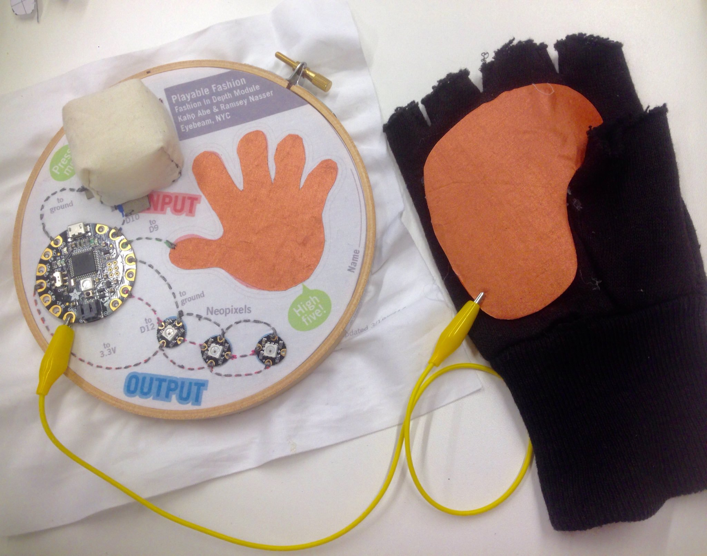

# Fashion in Depth

Fashion in Depth is a module which explores and builds the foundation for the materials and concepts behind soft circuits and electronics, wearable technology and the use of wearable technology prototyping/development tool *du jour* ([Adafruit’s FLORA](https://www.adafruit.com/products/659)).  The participants are lead through a series of demonstrations and exercises, with the goal for everyone to arrive at the same point by the end of the module, having learned the same basic skills, techniques and concepts, so that they are prepared to create their own prototypes collaboratively. 

This module begins at the basic concept of an electrical circuit (referring to a popular science class exercise: “making a circuit” and “breaking a circuit” using a battery and a lightbulb), and identifying that this idea is used throughout in the digital interfaces around us (traditional console game controller, mouse, keyboard, elevator, vending machine, etc). This basic concept is referred to throughout the course of the module. 