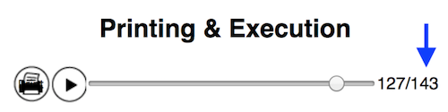

# World’s Slowest Computer

## Learning Goals
- Give students visceral, tactile experience with the foundations of computer science
- Slow down computation to the point that it can be looked at and discussed by a class
- Remain faithful to the underlying concepts, and use the exercise to explain e.g. loops and conditionals
- Identify the relationship between software and hardware
- Emphasize that computers do not 'know' what they are doing, but rather follow simple rules that can be manipulated to perform tasks
- Serve as a stepping stone on the way to learning how to write software
- Serve as a point of reference during later discussions while writing software

## Tools (for 15 students)
- Sponge Computer & Emulator
    - Emulator interface
    - The code is available at [http://nas.sr/sponge](http://nas.sr/sponge)
- 100x Yellow/green sponges x 3 groups of 5 students
- Markers
- Stopwatch

## Materials (for 15 students)
- Pack of index cards
- Pack of Post-Its
- Instruction printouts

# Lesson Plan

The exercise consists of organizing the group into teams, running programs, and discussion afterwards. A program can typically be run in around thirty minutes, leaving ten minutes for setup and ten minutes for discussion in a fifty minute class.

We describe below what a typical session centered on a single program would be like. We’ve found Diagonal Line, The Letter X, Creeper, and Circle to be a good progression of programs, totally four sessions.

If you feel the need you adjust the pacing of this session, ensure that the execution of the program is not interrupted, and that students are allowed to run their programs to completion in a single sitting. If execution and discussion take place on separate days, take care to have students document their progress and experience very well so that they have material to jog their memories when the discussion begins.

## Preparation
- Before each session, print out the programs that you want the computers to execute. You can choose from one of the PDFs listed above, print out a program from the emulator, or even write your own.
- Print out one copy of each program per group. Groups should be 3-5 students large, so plan accordingly depending on the size of your class.
- Note the number of instructions for each program, listed next to the the scrubber in the emulator. You will need this when measuring the students’ speed of the execution.

- Programs can be long! Binder clips are a good way to keep them together. Avoid staples or any more permanent binding to allow students the opportunity to figure out ways to spread out and read the programs.
- This exercise depends on secrecy! Make sure that the end result of a program is not known to anyone in the class beforehand. Do not label the stacks of paper either, and do not run the emulator before or during the execution of the program by the students. Instead, take good personal notes on the number of instructions and end result before hand so that you can assess your students’ progress.
## Typical Session

### Setup (10 minutes)

- Divide the class into groups of 3-5 students.
- Have each group build a sponge computer by laying the sponges in a grid and preparing their tables (described in detail in Background & Context / The Computer / Initialization)
- Explain each instruction they will see, and give examples of their uses (described in detail in Background & Context / The Computer / Assembly Language)

### Execution (30 minutes)

- Have a representative from each group come to the front of the class and receive a copy of the program. Make sure not to tell them what it does, and do not label the stack of code.
- Instruct the groups not to look at the program yet.
- Inform each team that they will race to execute their program correctly. Execution is correct when the team’s sponges match the emulator’s sponges. The first correct execution will win. Incorrect executions automatically lose. 
- Inform each team that they can call out “finished!” when they think they have finished executing.
- Once the groups are together, count down from ten and tell them to start executing. Start the stopwatch now.
- Allow teams to self-organize and determine their own roles. 
- Whenever a team calls “finished!”, record their time.
- Their approximate clock speed in Hertz is the number of instructions the program should have taken (from the emulator) divided by the number of seconds the team actually took. It will usually be a very small number.

### Discussion / Journaling (10 minutes)

- Once finished, discuss the challenges they faced and how they overcame them. This can be carried out as a classroom discussion or journaling exercise. Good questions include:
    - Why did they make the decisions they made?
    - How did they organize their teams? Why?
    - What was unexpected? 
    - What was surprising?
    - Can you describe the sponge program in plain english?
    - Can you rewrite the sponge program as [pseudocode](https://en.wikipedia.org/wiki/Pseudocode)?
    - When did you realize what you were making? What prevented you from knowing sooner?
    - How did the competition change the way you worked?
- Some connections to make, based on your observations, and some additional questions:
    - Jumping backwards is equivalent to a loop in a contemporary programming language
        - What changes each in iteration of the loops?
        - What keeps the loop from repeating forever?
    - Jumping forward is equivalent to an if statement in a contemporary programming language
    - Memory cells are analogous to variables in a contemporary programming language
        - Would the exercise be easier if they could name the cells? If so, why? What names would they give the cells?
        - What kinds of data are allowed in the cells? How is this different from a practical computer?
    - The sponges are analogous to the screen
        - What is its resolution compared to a laptop screen? A phone screen?
        - How many colors can it represent compared to a practical screen?
- You can use the emulator with the class now to run the program, step through it, and debug problems people may have had.

## Additional Sessions
- Additional Sessions proceed as above but with a different program.
- Later sessions can reference experiences in earlier sessions.

