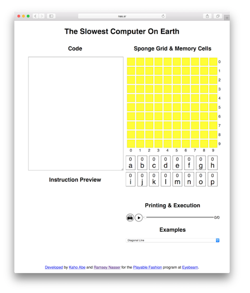
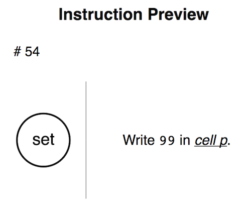
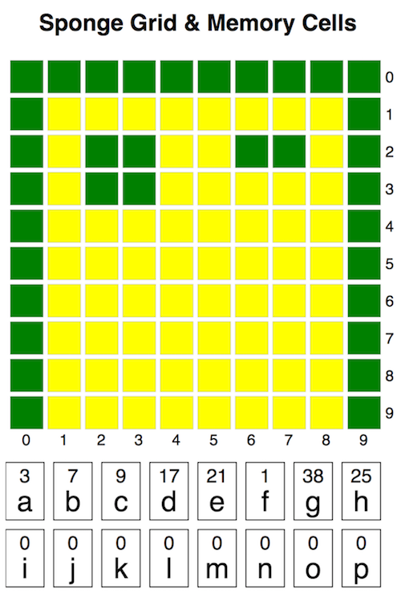
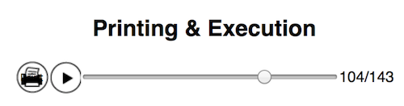

# World’s Slowest Computer

The workshop centers around manually operated sponge-based computers. Each computer consists of:

- A 10x10 grid of sponges green/yellow sponges, called “the screen”
- Sixteen post-it notes and markers, called “memory cells”
- 3-5 students, called “the processor”
- A stack of instructions to execute, called “the program”

### Initialization
A sponge computer is initialized by:

1. Arranging the 100 sponges in a 10x10 grid with their yellow sides facing up
2. Arranging the 16 post-its in two rows of eight
3. Labeling each post-it with a letter A through P
4. Placing a marker by the post-its

### Operation
Sponge computer programs are printouts paper clipped together. Each page represents an instruction. Instructions are followed in order, and executed in full, one at a time. Note that some instructions may require moving forward or backward in the instruction pages. Execution is finished when there the last instruction in the stack is executed.

### Programming Language
The language the sponge computer is programmed in resembles a simplified [assembly language](https://en.wikipedia.org/wiki/Assembly_language) for a contemporary computer. It has 10 instructions, consisting of arithmetic, comparisons, memory cell writing, jump, and plotting instructions. All instructions read inputs from memory cells and write results to memory cells, with the exception of the “set” instruction which additionally takes literal numbers as input.

The full list of instructions is the following:

- Plot: Flips a sponge at the row and column given by two memory cells
- Set: Writes a value to a memory cell
- Plus: Adds the values of two memory cells and writes the result in a third
- Minus: Subtracts the values of two memory cells and writes the result in a third
- Times: Multiplies the values of two memory cells and writes the result in a third
- Divide: Divides the values of two memory cells and writes the result in a third (see note about truncating division in Memory Model below)
- Less Than: Compares the values of two memory cells and writes 1 in a third if the first value was less than the second value
- Greater Than: Compares the values of two memory cells and writes 1 in a third if the first value was greater than the second value
- Jump: If a value in a cell is 1, instruction continues from the instruction with the number equal to the value of a given memory cell

### Memory Model
The sponge computer is a simple [register machine](https://en.wikipedia.org/wiki/Register_machine). What is traditionally referred to as a “register” we refer to as a “memory cell”. It lacks any kind of memory beyond its sixteen memory cells, in which it stores temporary values, instruction jump addresses, and everything else. The cells are only allowed to contain integers, and the sponge computer is incapable of manipulating numbers with decimals (real numbers, or floating point numbers in computer hardware parlance). Notably, this means that division is [*truncating*](https://en.wikipedia.org/wiki/Truncation). 7 ÷ 2 = 3, not 3.5.

### Turing Completeness
Within its bounded memory, the computer is [Turing complete](https://en.wikipedia.org/wiki/Turing_completeness#Non-mathematical_usage), meaning, from a theoretical perspective, it contains all the expressive power of any other programming language, including modern ones like JavaScript or C++. The jump, comparison, and set instructions are enough to simulate a Turing machine. This is important as this makes the sponge computer as “real” a computer as any other. It is not a simulation of computation, but rather *the real thing* on a smaller and slower level.

### Infinite Loops
Due to the turing-completeness of the computer, programs that run forever (known as [nontermination or divergence](https://en.wikipedia.org/wiki/Divergence_(computer_science))) are both possible and impossible to predict or prevent. This is especially true given the margin of error that results from human interpretation. Programs should be tested in the emulator before running on hardware to confirm that they termination. If a program runs for longer than seems reasonable during an exercise, a computer may decide to stop, or it may be stopped by a facilitator.

# The Emulator

The World's Slowest Computer is based on [an emulator](http://nas.sr/sponge) (available at [http://nas.sr/sponge](http://nas.sr/sponge)) that allows you to develop Sponge code on your computer and verify that it does what you want it to do before you execute it on real hardware (the sponges and the students). The emulator is online, and comes with a few programs built in to explore and study. The emulator works best in Google Chrome.

Sponge programs can be executed and stepped through, meaning you can move backwards and forwards through the execution to better understand it. The sponges and memory cells are visualized and updated as needed.

## Quick Start

To get started quickly, choose an example from the Examples drop down. This will load one of our example programs and execute it automatically. You will see the final state of the sponge grid and memory cells (under the Sponge Grid & Memory Cells heading), as well as the execution scrubber all the way on the right (under the Printing & Execution heading).

You can drag the scrubber left and right to scrub through the correct steps of the execution of the program, and the grid and memory cells will update automatically. The current instruction will also be highlighted in the Code area and visualized in the Instruction Preview area. Note that because of jump instructions there may be more execution steps than instructions, and instructions may repeat.

Loading and scrubbing through examples is the best way to get a feel for the emulator. You can edit the code, too, to see what changes it makes. After each edit you will have to hit the play button next to the scrubber to have the emulator execute the code with your changes.

## Overview

The window is divided into five sections, Code, Instruction Preview, Sponge Grid & Memory Cells, Printing & Execution, and Examples.

### Code
The top half of the left column is a text area where you can write sponge code. Each instruction is written on its own line. Each instruction is a simplified version of the full printed page that will be presented to students, and that is visible in the Preview section. When the Execution Scrubber is dragged left and right, the current line of execution will highlight.

### Instruction Preview

A preview of the currently selected instruction is displayed here. It corresponds to the actual printed page students will receive when doing the exercise. At the top left hand corner is a number indicating the number of the instruction in the sequence. In a circle on the left is the name of the instruction, and on the right is an English-language description of how to execute the instruction with specific values and memory cell names filled out.  

### Sponge Grid and Memory Cells 

At the top of the right column is a visualization of the grid of sponges and the memory cells the students will be writing to and reading from. This displays the correct state of the sponges and cells according to the current step, and can be used to debug problems. Scrubbing the execution scrubber will update this area automatically.

### Printing & Execution 
Under the Memory Cells are the controls that allow you to print, execute, and scrub through the program. The print button will compile all instructions into a printable PDF and open a printer dialog for you. The play button will execute the code in the Code area. This happens automatically when you choose an example, but you will have to hit play again if you edit the code.

Dragging the scrubber left and right will move change the "current step". This will update the visualization of the grid and memory cells, and the preview. It will also highlight the instruction in the Code section. The numbers to the right of the scrubber indicate the current step and the total number of steps.

### Examples
A drop down list of built in examples we have written that you can try out.